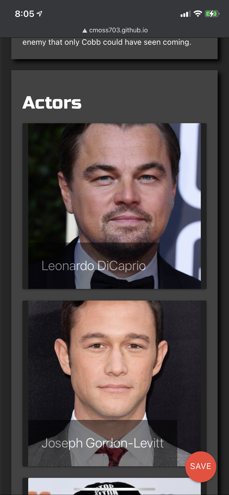
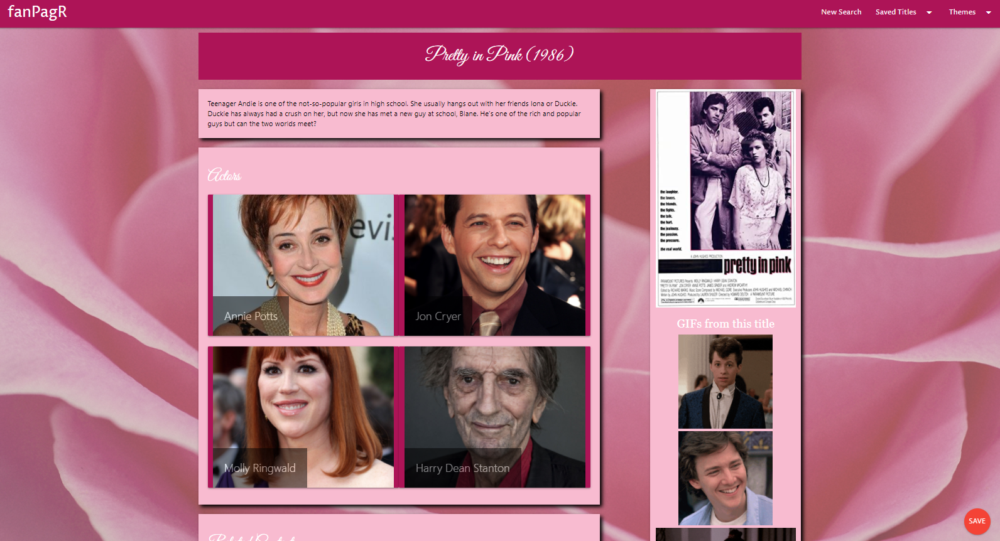

# fanPagR

## DESCRIPTION

We're all a fan of something. In this age, and especially in the last year, media has become increasingly more a part of our daily life. Binge-watching is the new reading. It's always exciting to find someone to talk about your favorite shows or movies with, and to find new content about your faves online. 

fanPagr allows the user to search for their favorite movie or TV show, and recieve a bunch of information about that title. 




Can't get enough of Westworld? Search for it on fanPagr! You'll be provided with the synopsis, GIFs from the show, trailers for related titles you may also like, and photos of the actors, which are clickable links to their OMDB pages where you can find other content they star in!


That's not all, though! fanPagr allows the user to create their own experience. You're not stuck with our default colors! We wouldn't do that to you. In the dropdown bar under "Themes", you'll find a variety of different genres that correspond to different page themes. Click on "Romance" and your page is transformed into a pretty pink layout featuring all your favorite content from that rom-com you love so much. Click on Noir and you're transported to a black-and-white mystery vibe. 



Need to go back and reference your page again? (Of course you do!) You can saved the title with the theme of your choice, and find it in the dropdown menu the next time you visit the page!


We're mobile friendly, too! The functionality is the same, but the navigation bar incorporates a hamburger icon that when touched, will show you the same saved and theme content as the desktop page. Same easy functionality!


It's hard to deny that this is the hottest new way to find all the content on your favorite titles. Give it a try!

<figure class="video_container">
  <iframe src="https://drive.google.com/file/d/1D5QlpQw00Nbb_byOF_6wYVYCz0M-zVIe/preview" frameborder="0" allowfullscreen="true"> </iframe>
</figure>

## CODE STUFF

How did we generate this app? What functions did we use, and what was the thought process? Wouldn't you like to know! Okay, we'll spill.

We incorporated a good balance of html, css, and javascript in the project.

The html file covers the bones of the site. This is where the navigation bar layout, dropdown items for themes, the homepage features, the footer, etc. live. 

CSS was utilized a fair amount as well, since we have so many different themes. We utilized Materialize (see link below) for some basic css features, such as the grid and the navigation bar, but the themes were styled manually using colors and background images.

Almost all of the searched content was created dynamically in Javascript, using jQuery. Everything that happens after you click the search button is made in the javascript file. We have a total of four different AJAX calls for different websites. The sites we are pulling from are listed below in the 'CONTENT' section. Elements are pulled from these calls and either displayed on the page, or used for a different call or function. 

    There is a floating save button on the bottom right corner of the page, which when clicked, will save both the title and the theme css link as an object in local storage. The dropdown menu for "Saved Titles" will store this title. When you revisit 


## CONTENT UTILIZED

links to materialize, API calls, etc. 

## User Story

```
AS A DEDICATED TV & MOVIE FAN, I want an app that lets me create fan pages for my favorite programs.

GIVEN that I am a user,
WHEN I enter a TV show or movie,
THEN my personal fan page is created
WITH gifs, movie/show info, actors from the show/movie, links to their pgaes and related content.

```

## See the project Wireframe!

This is a starting point for our webpage:


