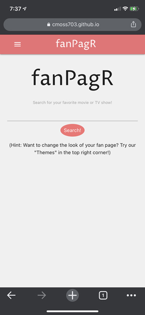
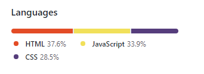

# fanPagR

## DESCRIPTION

We're all a fan of something. In this age, and especially in the last year, media has become increasingly more a part of our daily life. Binge-watching is the new reading. It's always exciting to find someone to talk about your favorite shows or movies with, and to find new content about your faves online. 

fanPagr allows the user to search for their favorite movie or TV show, and return a fully developed fan page for that title. 


Can't get enough of Westworld? Search for it on fanPagr! You'll be provided with the synopsis, GIFs from the show, trailers for related titles you may also like, and photos of the actors, which are clickable links to their OMDB pages where you can find other content they star in!


That's not all, though! fanPagr allows the user to create their own experience. You're not stuck with our default colors! We wouldn't do that to you. In the dropdown bar under "Themes", you'll find a variety of different genres that correspond to different page themes. Click on "Romance" and your page is transformed into a pretty pink layout featuring all your favorite content from that rom-com you love so much. Click on Noir and you're transported to a black-and-white mystery vibe. The image below shows our "Action" theme, in action.


Need to go back and reference your page again? (Of course you do!) You can saved the title with the theme of your choice, and find it in the dropdown menu the next time you visit the page!


We're mobile friendly, too! The functionality is the same, but the navigation bar incorporates a hamburger icon that when touched, will show you the same saved and theme content as the desktop page. The same easy functionality!



It's hard to deny that this is the hottest new way to find all the content on your favorite titles. Give it a try!

[](https://drive.google.com/file/d/1D5QlpQw00Nbb_byOF_6wYVYCz0M-zVIe/preview)

## WEBSITE AND GITHUB REPO

What are you waiting for? Give it a try yourself!

[fanPagR](https://cmoss703.github.io/fanPagR/)

Here is a link to the github repository for the site, so you can see all the work we've done ... if you're into that kind of thing.

[fanPagR Githhub Repo](https://github.com/cmoss703/fanPagR)

## CODE STUFF

How did we generate this app? What functions did we use, and what was the thought process? Wouldn't you like to know! Okay, we'll spill.

We incorporated a good balance of html, css, and javascript in the project.



The html file covers the bones of the site. This is where the navigation bar layout, dropdown items for themes, the homepage features, the footer, links to frameworks and jQuery, etc. live. 

CSS was utilized a fair amount as well, since we have so many different themes. We utilized Materialize (see link below in 'CONTENT') for some basic css framework, such as the grid and the navigation bar, but the themes were styled manually using colors and background images. Each theme has it's own css file. When a user clicks on a theme in the dropdown, a javascript function is used to switch that css file from default to the corresponding theme. There is also a "fanpagr.css" that holds all of the custom css that is common throughout all themes.


Almost all of the searched content was created dynamically in Javascript, using jQuery. Everything that happens after you click the search button is made in the javascript file. We have a total of four different AJAX calls for different websites. The sites we are pulling from are listed below in the 'CONTENT' section. Elements are pulled from these calls and either displayed on the page, or used for a different call or function. 

When a search is entered sucessfully, an AJAX function is called to get the title, synopsis, movie poster, and list of actors from OMDB. All but the actors are displayed on the page in this call. The actors are then used in an AJAX function to call images and links of them from TVMaze, which are then displayed on the page. The images live within link elements, so when you click on the image, another tab opens with the actor's TVmaze profile. The title of the movie is also used in an AJAX function to call GIFs from GIPHY, and related content from TasteDive. We set limits on these calls so only the top 4 actors, the first 15 GIFs, and the first 4 related titles are shown, so the page has a nice flow. 


When a title from the "Related Content" is shown, there is a video for the trailer and a link to the Wikipedia page. If a user clicks on the title text, they are shown the synopsis for that title.


There is a floating save button on the bottom right corner of the page, which when clicked, will save both the title and the theme css link as an object in local storage. A toast message will then appear telling the user that the fanpage was saved; or if the title has been saved before, the toast will inform the user that it has already been saved. The dropdown menu for "Saved Titles" will store this title. When you revisit that title from the dropdown page, the click function uses the title from storage to call on the search function again, and applies the theme css file to the html document.


If a user misspells something or enters a title that doesn't exist, they'll be shown a modal box that tells them the search didn't quite work.


A lot of work went into making this page work smoothly and properly. We hope you enjoy it!

## CONTENT UTILIZED

Many references were used in the making of this website! Find the links to them below:

[Materialize CSS](https://materializecss.com/): Used as a CSS framework. 

[Google Fonts](https://fonts.google.com/): Used to get fun fonts into our themes.

[jQuery](https://api.jquery.com/): Javascript library used to simplify DOM manipulation.

[favicon.io](https://favicon.io/): To generate our custom favicon image.

[OMDb API](http://www.omdbapi.com/): API used to get movie and TV show data.

[TVMaze API](https://www.tvmaze.com/api): API used to retrieve actor images and link URLS to their TVMaze profiles.

[GIPHY API](https://developers.giphy.com/): API used to Generate GIFs of each searched title.

[TasteDive API](https://tastedive.com/read/api): API used to get related content for each title.

## USER STORY

```
AS A DEDICATED TV & MOVIE FAN, I want an app that lets me create fan pages for my favorite programs.

GIVEN that I am a user,
WHEN I enter a TV show or movie,
THEN my personal fan page is created
WITH gifs, movie/show info, actors from the show/movie, links to their pages and related content.
IF I want to customize my fan page,
THEN I can choose from a variety of themes to style the page.
IF I want to reference the page later,
THEN I can save the theme and title to my local storage.

```

## BEGINNING STAGES

At the beginning of this project, we created a WireFrame image of what the page might look like. See it below! We came a long way from the beginning, and we're really stoked about it. We hope you are too!


